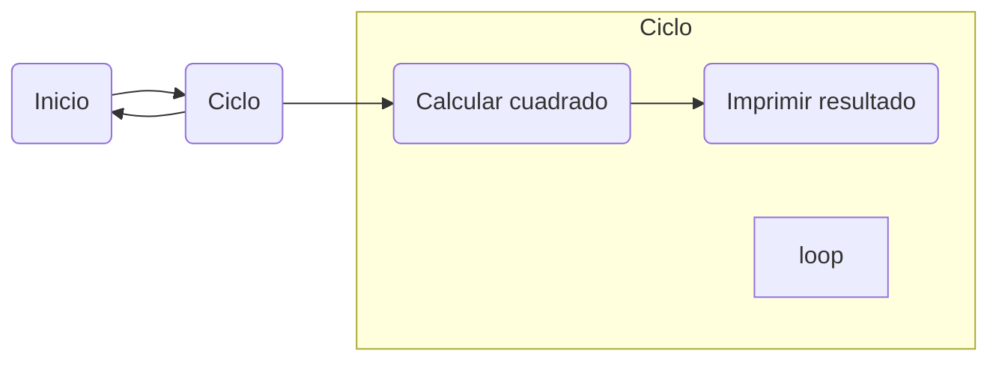
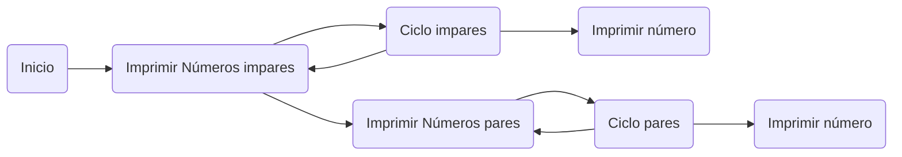
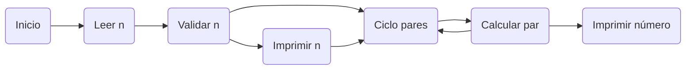

# seventh-challenge

## read my notebook to watch everything, thx, visca barça 🔵🔴🔵🔴

here it is the 1st, 2nd, 3rd points flowcharts

------
## 1st

```mermaid
graph LR
A(Inicio) --> B(Ciclo)
B(Ciclo) --> C(Calcular cuadrado)
C(Calcular cuadrado) --> D(Imprimir resultado)
B(Ciclo) --> A(Inicio)

subgraph Ciclo
    loop
        C(Calcular cuadrado)
        D(Imprimir resultado)
    end
```
--------

## 2nd

```mermaid 
graph LR
A(Inicio) --> B(Imprimir Números impares)
B(Imprimir Números impares) --> C(Ciclo impares)
C(Ciclo impares) --> D(Imprimir número)
C(Ciclo impares) --> B(Imprimir Números impares)

B(Imprimir Números impares) --> E(Imprimir Números pares)
E(Imprimir Números pares) --> F(Ciclo pares)
F(Ciclo pares) --> G(Imprimir número)
F(Ciclo pares) --> E(Imprimir Números pares)

```

---------

## 3rd

```mermaid
graph LR
A(Inicio) --> B(Leer n)
B(Leer n) --> C(Validar n)
C(Validar n) --> D(Imprimir n)
C(Validar n) --> E(Ciclo pares)

D(Imprimir n) --> E(Ciclo pares)

E(Ciclo pares) --> F(Calcular par)
F(Calcular par) --> G(Imprimir número)
F(Calcular par) --> E(Ciclo pares)


```
